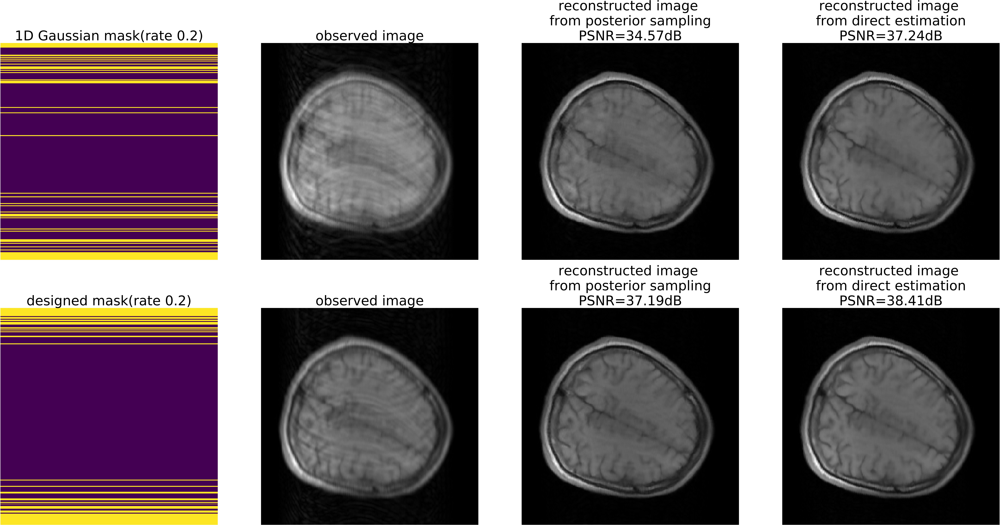

# posterior sampling for reconstruction and uncertainty quantification
Posterior sampling (from the paper "[Deep Bayesian Inversion](https://arxiv.org/abs/1811.05910)") for MRI uncertainty quantification and reconstruction

## Problem Formulation
The code here is to solve an inverse problem by conditional WGAN. The optimization problem can be defined below.

Actually, this loss might cause mode collapse and the implementation is different from the loss function. For more details, please refer to [Deep Bayesian Inversion](https://arxiv.org/abs/1811.05910).

## Results
Here is pixel-wise standard deviation for masks with sampling rate 0.1 and 0.5, which is the quantified uncertainty from posterior samples.

We can calculate the mean of the posterior samples for reconstruction. We also use the uncertainty to design the mask and compare with baseline(1D Gaussian).

We also obtain the uncertainty in the frequency domain below, which can be used for mask design.

the predicted uncertainty has strong correlations with PSNR and MSE, which is shown below.

The figure below shows the comparison between our mask design method and other baselines.

## Usage
The code can't run since I don't provide the MRI dataset. If you have 256x256 complex MRI dataset, you can modify the class `MRIDataSet` in `mri_utils.py`. For other applications, you may modify the code or contact me for more details.

- `train.py`: train the conditional WGAN
- `model_eval_3_5.ipynb`: visualize the results
- `uncertainty_descent.ipynb`: mask design using uncertainty

